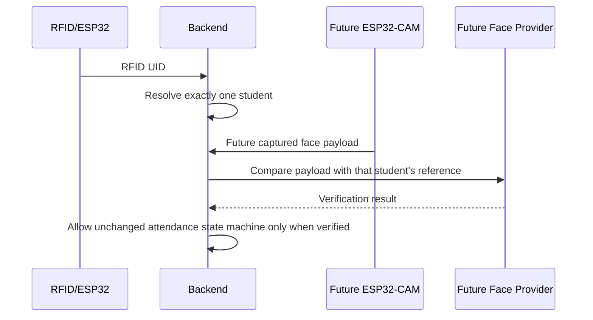
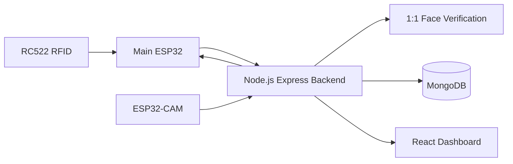
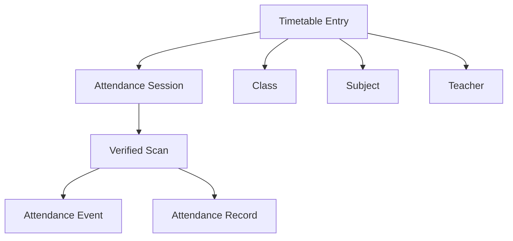
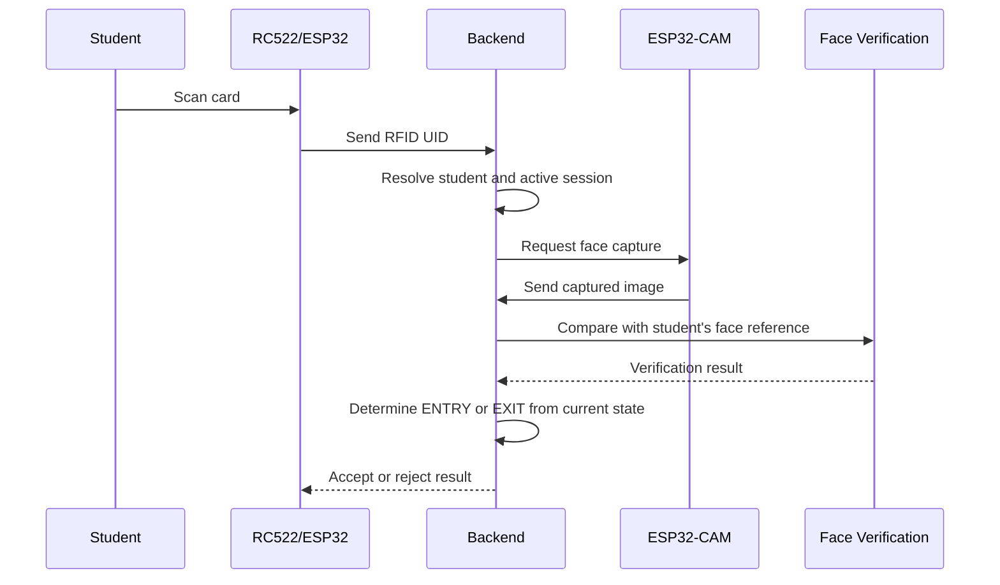
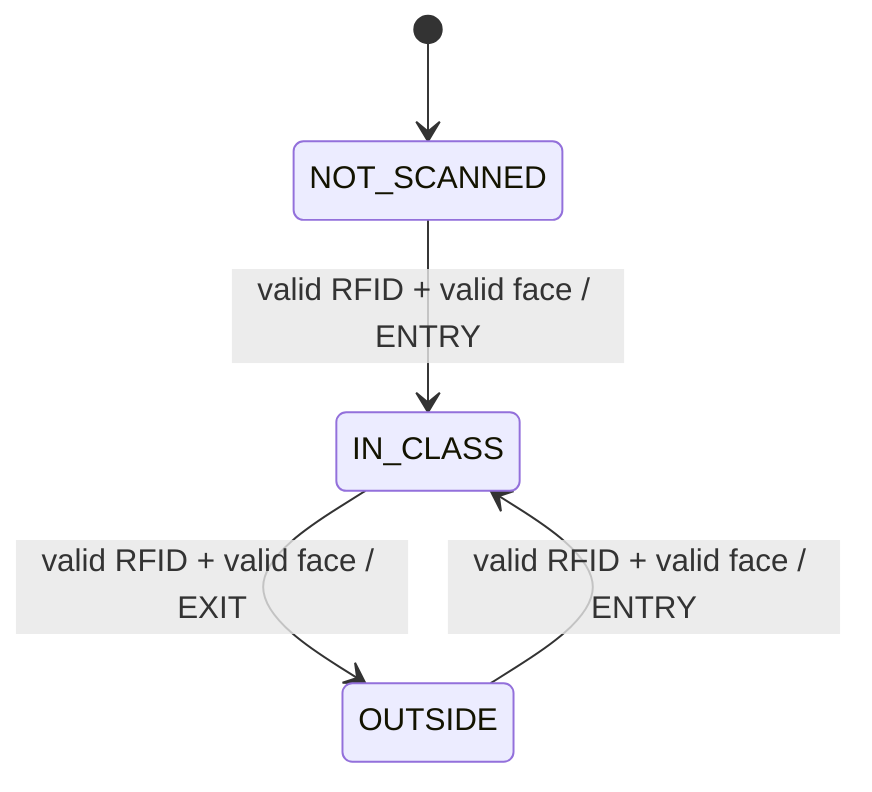
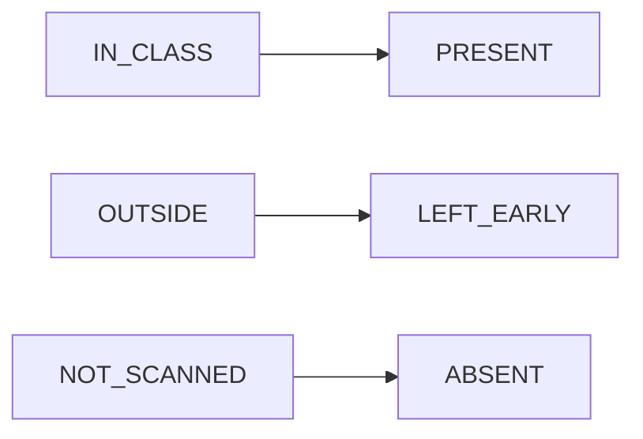

# System Architecture

## Scope

This document records the finalized architecture for the Smart Classroom RFID Attendance System. Phase 6 adds a real local WASM face engine over the Phase 5 enrollment foundation. The engine runs on Node 24, loads face detection/landmark/recognition weights, generates descriptors, and performs direct 1:1 comparison. Acceptance remains disabled until threshold calibration.

Phase 5 adds an enrollment-ready data and service boundary. It does not claim that camera capture, a face model, biometric comparison, or liveness detection is implemented.

## Components

- **Main ESP32:** reads RFID cards through the RC522, controls the OLED, buzzer, and LEDs, and communicates with the backend.
- **RC522:** provides the RFID UID used as the primary student identifier.
- **ESP32-CAM:** captures a face image after an RFID scan.
- **Backend:** identifies the student by RFID, accepts the future face-verification result, validates timetable/session context, determines movement, and persists events and records.
- **Face-verification service:** future service used by the backend to compare the captured face with the RFID-identified student's registered face reference.
- **MongoDB:** future persistence for users, students, teachers, subjects, classes, timetables, sessions, events, records, and face references.
- **React dashboard:** future interface for live attendance, registers, dashboards, and subject-wise analytics.

## Frontend Integration

The React/Vite frontend uses a centralized client configured by `VITE_API_BASE_URL`. Its dashboard shell provides responsive admin, teacher, and student navigation. Timetable management, session start, live attendance polling, session close, attendance register, subject reports, and student attendance views use the existing backend APIs. The frontend does not calculate attendance percentages or implement movement/finalization rules.

Management pages for students, teachers, subjects, and classes show an unavailable state because Phase 3 does not expose those CRUD APIs.

Phase 5 replaces those unavailable setup surfaces with backend CRUD and guided frontend workflows. The Setup Center orders the dependency flow: classes, subjects, teachers, students, manual development RFID registration, provider-backed face enrollment, timetable, and review.

## Face Verification Boundary



The current service uses `FACE_ENGINE=wasm` when enabled. It returns `THRESHOLD_NOT_CONFIGURED` when descriptors can be compared but no calibrated threshold exists. Development mode remains a separate explicit test mode and is not production verification. Face-reference reads omit reference data and metadata from normal responses; provider credentials remain backend-only.

## Phase 6 Engine Assessment

The selected local engine is `@vladmandic/face-api` with TensorFlow.js WASM and `@canvas/image`. It was selected because it supports face detection, stable 128-dimensional descriptors, and direct 1:1 distance comparison without a paid API and can accept future ESP32-CAM image uploads. The package's default Node entry requires native `tfjs-node`, so the backend explicitly uses `face-api.node-wasm.js` to remain compatible with Node 24.

The engine uses Euclidean descriptor distance, where lower distance means a closer match. `FACE_MATCH_THRESHOLD` must be configured after calibration on representative enrollment and verification samples from the actual classroom camera. No threshold is currently claimed or applied.

Raw uploads are held in memory, limited to configured size and image types, and are not stored or logged by the transport layer. The future provider must generate the reference embedding at enrollment, store only the protected provider reference, detect zero/multiple faces, and compare against only the student selected after RFID resolution.



## Hardware-to-Backend Flow

1. The student scans an RFID card.
2. The RC522 sends the RFID UID to the main ESP32.
3. The ESP32 sends the UID to the backend.
4. The backend resolves the UID to one student.
5. The ESP32-CAM captures the student's face.
6. The captured image is sent for comparison with that student's registered face reference.
7. The backend accepts or rejects the scan based on RFID and the provider-authoritative face-verification result.
8. The backend returns the attendance result for the ESP32 display, buzzer, and LEDs.

RFID remains the identifier. The camera never searches all students for a match. The future ESP32-CAM only sends an image to the backend; it does not know MongoDB, embeddings, or thresholds.

## Timetable-to-Attendance Flow

An administrator or responsible person creates classes, subjects, teachers, and timetable entries. Each timetable entry connects one class, subject, teacher, day, start time, and end time. Starting a session from a timetable entry fixes the subject and class to which all attendance belongs.



## RFID and Face Verification Flow



A failed RFID lookup or failed face verification input creates no movement event and does not change the student's current state. Actual face comparison is not implemented in Phase 3.

## Movement State Machine

During an active session, the current state determines the event type. There are no separate Enter and Exit buttons.



The state transitions are:

- `NOT_SCANNED -> ENTRY -> IN_CLASS`
- `IN_CLASS -> EXIT -> OUTSIDE`
- `OUTSIDE -> ENTRY -> IN_CLASS`

Invalid verification leaves the current state unchanged.

## Session Closing Logic

When the active timetable session closes, the final status is derived from the current state:



`LEFT_EARLY` and `ABSENT` do not count as `PRESENT`. The design does not track time spent in class and does not include duration fields.

## Subject-Wise Attendance Calculation

Attendance is calculated separately for each subject assigned to the student's class:

```text
attendancePercentage =
(PRESENT completed sessions / total completed sessions) * 100
```

For example, 18 `PRESENT` results across 20 completed FSWD sessions gives `18 / 20 * 100 = 90%`. `LEFT_EARLY` and `ABSENT` remain completed session outcomes but are not counted in the numerator. The subject list is data-driven from administrator-created subjects and class assignments.
