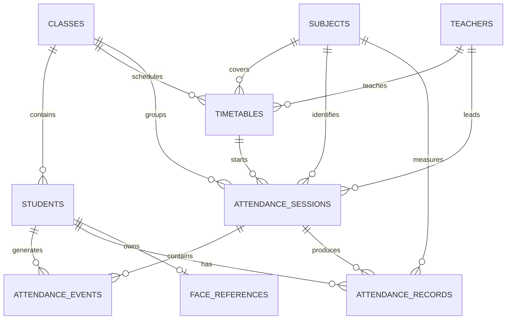

# Database Architecture

## Status

Phase 2 implements the Mongoose schema foundation, optional MongoDB connection, relationships, validation, and indexes described here. CRUD operations, attendance business logic, and MongoDB-backed API routes are not implemented yet.

## Collections

The final database contains these ten collections:

1. `users`
2. `students`
3. `teachers`
4. `subjects`
5. `classes`
6. `timetables`
7. `attendanceSessions`
8. `attendanceEvents`
9. `attendanceRecords`
10. `faceReferences`

## Collection Responsibilities

### `users`

Stores application users and their roles. Implemented fields are `name`, `email`, `password` (placeholder only), and `role` (`ADMIN`, `TEACHER`, or `STUDENT`). Email is required, normalized to lowercase, and unique. Timestamps are enabled. Password hashing is not implemented.

### `students`

Stores `userId`, student name, unique `rollNumber`, `classId`, and unique normalized `rfidUid`. `userId` references `User` and `classId` references `Class`; `classId` is indexed. The RFID UID identifies the student; it is not a face-recognition search key.

### `teachers`

Stores `userId`, name, and unique `employeeId`. `userId` references `User`. Timestamps are enabled.

### `subjects`

Stores administrator-created `name`, unique `code`, optional `description`, and `isActive` (default `true`). Attendance is not limited to a hardcoded subject list.

### `classes`

Stores required `name`, `section`, and `academicYear`, plus `isActive` (default `true`). This represents a student class/section.

### `timetables`

Stores required `classId`, `subjectId`, `teacherId`, `dayOfWeek`, `startTime`, and `endTime`, plus optional `room` and `isActive` (default `true`). Times use `HH:mm` strings and validate that `endTime` is not earlier than `startTime`. The model has indexes for each reference and a scheduling index on class, day, and start time.

### `attendanceSessions`

Represents one actual class attendance session. It connects to required `timetableId`, `subjectId`, `classId`, and `teacherId` references, and stores required `date`, `startTime`, `endTime`, and `status` (`ACTIVE` or `CLOSED`, default `ACTIVE`). It has reference indexes and a date/status index. It contains no duration or percentage fields.

### `attendanceEvents`

Stores movement fields `studentId`, `sessionId`, `type` (`ENTRY` or `EXIT`), required explicit `timestamp`, `rfidUid`, `faceVerified`, and `verificationStatus` (`VERIFIED` or `REJECTED`):

```text
studentId
sessionId
type              // ENTRY | EXIT
timestamp
rfidUid
faceVerified
verificationStatus
```

Student and session references are indexed, as is session plus timestamp. There is no duration field. Invalid scans do not create movement events; that rule will be enforced by later business logic.

### `attendanceRecords`

Stores one student's subject-specific result for an attendance session. Implemented fields are:

```text
studentId
subjectId
sessionId
date
currentState      // NOT_SCANNED | IN_CLASS | OUTSIDE
finalState        // IN_CLASS | OUTSIDE | NOT_SCANNED
finalStatus       // PRESENT | LEFT_EARLY | ABSENT
```

`currentState` defaults to `NOT_SCANNED`; `finalState` and `finalStatus` are nullable until session close. Student, subject, and session references are indexed, and the student/session pair is unique. During the active session, `currentState` changes. When the session closes, `finalState` and `finalStatus` are finalized by future business logic. There is no duration field.

### `faceReferences`

Stores `studentId`, optional `provider`, `model`, `referenceType`, `referenceImageUrl`, flexible `metadata`, and `isActive` (default `true`). The active student reference is uniquely indexed. This reference is used only after RFID has identified the student, for 1:1 verification. Raw image binaries and face recognition logic are not implemented.

## Implemented Schema Rules

- ObjectId references connect the ten models without embedding unrelated records.
- Fixed workflow values use enums for roles, timetable days, session status, event types, verification status, live states, final states, and final statuses.
- Timestamps are enabled on every model.
- Unique indexes cover user email, student roll number, student RFID UID, teacher employee ID, subject code, active student face reference, and student/session attendance records.
- Supporting indexes cover class, subject, teacher, timetable scheduling, session date/status, event session/timestamp, and attendance record lookups.
- No model stores `attendancePercentage`, `totalClasses`, or duration.

## Relationships



The required reference paths are:

- Student -> Class
- Timetable -> Class, Subject, Teacher
- AttendanceSession -> Timetable, Subject, Class, Teacher
- AttendanceEvent -> Student, AttendanceSession
- AttendanceRecord -> Student, Subject, AttendanceSession
- FaceReference -> Student

## Live State and Final Status

For an active session, each applicable student has one current state:

```text
NOT_SCANNED -> IN_CLASS -> OUTSIDE -> IN_CLASS
```

At session close:

- `IN_CLASS` becomes `PRESENT`.
- `OUTSIDE` becomes `LEFT_EARLY`.
- `NOT_SCANNED` becomes `ABSENT`.

Only `PRESENT` counts toward attendance percentage. `LEFT_EARLY` and `ABSENT` do not.

## Subject-Wise Calculation

For each student and subject, calculate from completed attendance records:

```text
attendancePercentage =
(PRESENT completed sessions / total completed sessions) * 100
```

Example:

```text
FSWD: 18 PRESENT / 20 completed sessions * 100 = 90%
```

The percentage should be derived from records whenever requested, rather than stored as a permanent hardcoded value. It applies to every subject assigned to the student's class.
